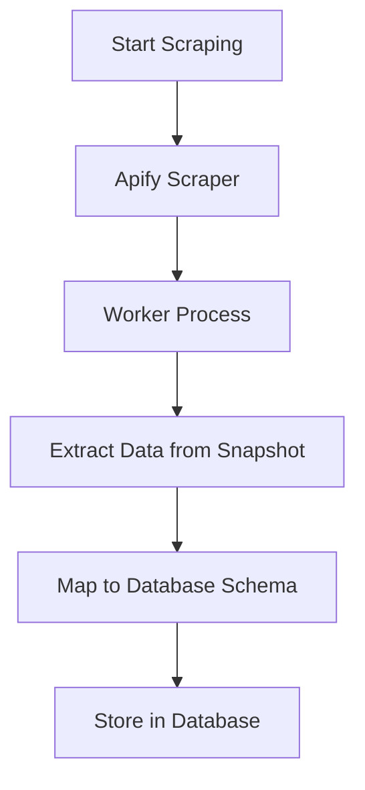

# Competitor Ad Creatives System

## Overview

This system handles the scraping, storage, and retrieval of competitor ad creatives from Facebook's Ad Library via Apify. The implementation supports storing multiple image/video formats and provides comprehensive API endpoints for data management.

## Database Schema

### Table: `adgraam.competitor_ad_creatives`

```sql
CREATE TABLE adgraam.competitor_ad_creatives (
    id SERIAL PRIMARY KEY,
    competitor_id INTEGER,
    run_id VARCHAR(255) NOT NULL,
    organisation_id UUID NOT NULL,
    ad_archive_id VARCHAR(255) UNIQUE NOT NULL,
    page_id VARCHAR(255) NOT NULL,
    page_name VARCHAR(255),
    is_active BOOLEAN DEFAULT true,
    page_profile_picture_url TEXT,
    title TEXT,
    body TEXT,
    link_url TEXT,
    caption TEXT,
    cta_text VARCHAR(100),
    display_format VARCHAR(50),
    
    -- Arrays for storing multiple image and video URLs from cards
    resized_image_urls TEXT[],
    original_image_urls TEXT[],
    video_hd_urls TEXT[],
    video_sd_urls TEXT[],
    
    -- Legacy single image/video fields for backward compatibility
    image_urls TEXT[],
    video_urls TEXT[],
    
    publisher_platforms TEXT[],
    start_date TIMESTAMP WITH TIME ZONE,
    end_date TIMESTAMP WITH TIME ZONE,
    
    -- Store the full snapshot as JSONB for future reference
    raw_data JSONB,
    
    created_at TIMESTAMP WITH TIME ZONE DEFAULT now(),
    updated_at TIMESTAMP WITH TIME ZONE DEFAULT now()
);
```

### Key Features

1. **Multiple Image/Video Support**: Stores both resized and original image URLs from ad cards
2. **JSONB Raw Data**: Complete Apify response stored for future analysis
3. **Legacy Compatibility**: Maintains `image_urls` field for backward compatibility
4. **Proper Indexing**: Optimized for common query patterns
5. **Row Level Security**: Organization-based access control

## Data Flow

### 1. Scraping Process



### 2. Data Extraction

From the Apify response, we extract:

- **Basic Ad Info**: title, body, caption, CTA text
- **Page Info**: page_id, page_name, profile picture
- **Media Arrays**: Multiple resized/original images and HD/SD videos
- **Raw Snapshot**: Complete JSON for future analysis

### 3. Data Mapping

The `apicreaiveToDbCompetitor` function handles:

```typescript
// Extract image and video URLs from cards
if (apiCreative.snapshot?.cards && Array.isArray(apiCreative.snapshot.cards)) {
  apiCreative.snapshot.cards.forEach(card => {
    if (card.resized_image_url) resized_image_urls.push(card.resized_image_url);
    if (card.original_image_url) original_image_urls.push(card.original_image_url);
    if (card.video_hd_url) video_hd_urls.push(card.video_hd_url);
    if (card.video_sd_url) video_sd_urls.push(card.video_sd_url);
  });
}
```

## API Endpoints

### 1. Get All Competitor Ads

```http
GET /api/competitor-ads?limit=50&offset=0
```

**Response:**
```json
{
  "success": true,
  "message": "Competitor ads retrieved successfully",
  "data": [
    {
      "id": 1,
      "ad_archive_id": "123456789",
      "page_name": "Competitor Page",
      "title": "Ad Title",
      "body": "Ad body text",
      "resized_image_urls": ["url1", "url2"],
      "original_image_urls": ["url1", "url2"],
      "video_hd_urls": ["video_url"],
      "raw_data": { ... }
    }
  ],
  "pagination": {
    "limit": 100,
    "offset": 0,
    "total": 150
  }
}
```

### 2. Get Ads by Page

```http
GET /api/competitor-ads/page/{page_id}
```

### 3. Get Single Ad

```http
GET /api/competitor-ads/{ad_archive_id}
```

### 4. Delete Ad

```http
DELETE /api/competitor-ads/{ad_archive_id}
```

## Usage Examples

### Starting a Scraping Job

```typescript
import { startScrapperService } from '../services/adScrapServices';

const result = await startScrapperService(
  'https://www.facebook.com/ads/library/?active_status=all&ad_type=all&country=ALL&q=Nike',
  'https://nike.com',
  'user_id',
  'organisation_id'
);
```

### Retrieving Competitor Ads

```typescript
import { getScrapedAdsByOrganisation } from '../repositories/adCompetitorCreativesRepository';

const { data, error, count } = await getScrapedAdsByOrganisation(
  'organisation_id',
  100, // limit
  0   // offset
);
```

## Key Improvements

1. **Enhanced Image Storage**: Both resized and original URLs stored separately
2. **Video Support**: HD and SD video URLs from cards
3. **Robust Error Handling**: Comprehensive error handling throughout the pipeline
4. **Type Safety**: Strongly typed interfaces for all data structures
5. **Pagination**: Efficient pagination for large datasets
6. **Raw Data Preservation**: Complete Apify response stored for future analysis

## Migration Notes

- The new schema is backward compatible with existing `image_urls` field
- Raw data is now stored as JSONB instead of JSON for better query performance
- New array fields support multiple media items per ad creative

## Security Features

- Row Level Security (RLS) enabled
- Organization-based access control
- Service role policies for backend operations
- Input validation with Zod schemas

## Performance Optimizations

- GIN index on JSONB raw_data field
- Indexes on commonly queried fields
- Efficient pagination with offset/limit
- Optimized database queries with proper joins 